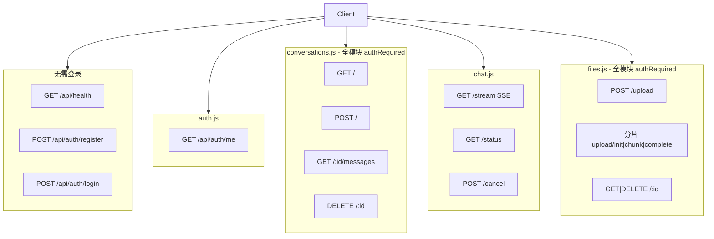

# 阶段 0：环境与全局地图

## 目标

能本地跑通前后端，口述请求从浏览器到 MySQL 的粗线路径，并说出四个后端路由模块的职责。

---

## 1. 启动清单

```bash
# 1. MySQL（Docker 示例见根 README）
cd backend
cp .env.example .env   # 编辑 DB_*、JWT_SECRET；LLM_API_KEY 可先留空
npm install
npm run db:init
npm run dev            # http://localhost:3001

# 2. 前端（新终端）
cd frontend
npm install
npm run dev            # http://localhost:5173
```

**验收**：浏览器打开 `http://localhost:5173` → 注册/登录 → 发一条消息 → 无 `LLM_API_KEY` 时应看到逐字 mock 回复。

---

## 2. 端口与代理

| 组件 | 地址 | 说明 |
|------|------|------|
| 前端 dev | `http://localhost:5173` | Vite |
| 后端 API | `http://localhost:3001` | Express |
| 浏览器请求 | `/api/*` | 由 Vite 代理到 3001 |

代理配置见 `frontend/vite.config.js`：

```js
proxy: {
  '/api': { target: 'http://localhost:3001', changeOrigin: true },
}
```

前端 axios `baseURL: '/api'`，因此组件里写的是 `/conversations`，实际请求为 `5173/api/conversations` → 代理到 `3001/api/conversations`。

---

## 3. 应用入口

### 后端 `backend/src/index.js`

```
dotenv → express + cors + json(2mb)
  → GET /api/health
  → /api/auth、conversations、chat、files
  → 404 兜底
  → 全局错误中间件
启动时：cleanupExpiredUploadSessions → loadMcpConfig → startMcpServers → listen
```

### 前端 `frontend/src/main.jsx`

```
Provider(Redux) → BrowserRouter → App
```

### 前端 `frontend/src/App.jsx`

- `/login` → `LoginPage`（公开）
- `/` → `RequireAuth` → `ChatPage`（读 Redux `auth.token`）
- `*` → 重定向 `/`

---

## 4. 四路由模块地图



| 模块 | 挂载路径 | 职责 |
|------|----------|------|
| `auth.js` | `/api/auth` | 注册、登录、JWT 签发；`/me` 需鉴权 |
| `conversations.js` | `/api/conversations` | 会话 CRUD、历史消息（含附件元数据、toolCalls） |
| `chat.js` | `/api/chat` | SSE 流式对话、生成状态、取消 |
| `files.js` | `/api/files` | 上传、解析状态、分片大文件 |

---

## 5. 请求类型区分（DevTools）

| 类型 | 典型接口 | 客户端 |
|------|----------|--------|
| REST JSON | `/api/auth/login`、`/api/conversations` | axios（`lib/api.js`） |
| SSE 流 | `/api/chat/stream?...` | `fetch` + `ReadableStream`（`lib/sse.js`） |

发消息后 Network 里应看到：**一条长时间 pending 的 stream 请求** + 若干短 XHR。

---

## 6. 环境变量速查

见 `backend/.env.example`：

| 变量组 | 作用 |
|--------|------|
| `DB_*` | MySQL 连接 |
| `JWT_*` | 无状态登录 |
| `LLM_*` | 上游模型；**留空 = mock 流** |
| `CONTEXT_*` | 长对话压缩阈值（可选） |
| `UPLOAD_*` / `CHUNK_*` | 附件大小与分片 |
| `TAVILY_API_KEY` | MCP 联网搜索（可选） |

---

## 7. 阶段验收（自测口述）

- [ ] 前端 5173、后端 3001、代理如何把 `/api` 转到后端
- [ ] `auth` / `conversations` / `chat` / `files` 各负责什么
- [ ] mock 模式：无 `LLM_API_KEY` 时 `chat.js` 逐字 `send('delta')` 模拟流
- [ ] REST 与 SSE 分别用 axios 还是 fetch

---

## 8. 面试话术（示例）

1. **项目架构**：前后端分离，Vite 开发态代理 `/api`，生产可同域或 Nginx 反代。
2. **为何四个路由文件**：按业务域拆分，会话与聊天流分离，便于 SSE 单独维护。
3. **入口职责**：`index.js` 只做装配与 MCP 生命周期，业务在 `routes` + `services`。

下一阶段 → [01-data-security.md](./01-data-security.md)
