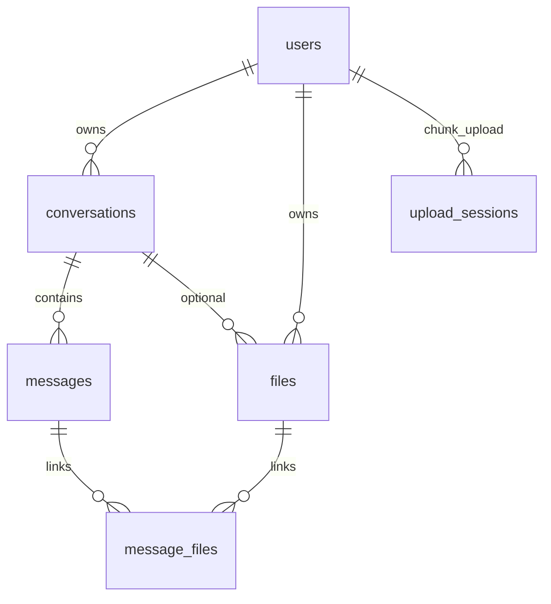

# 阶段 1：数据模型与安全基线

## 目标

理解表关系、多租户隔离、JWT 在 REST 与 SSE 中的传递方式。

---

## 1. ER 关系



### 表说明（`backend/src/db/init.js`）

| 表 | 关键字段 | 面试要点 |
|----|----------|----------|
| `users` | `username` UNIQUE，`password` 存 bcrypt 哈希 | 接口永不返回 password |
| `conversations` | `title`，`summary`，`summary_up_to_message_id` | 长上下文压缩结果存会话行 |
| `messages` | `role` user/assistant/system，`tool_calls` JSON | 刷新后工具轨迹可回显 |
| `files` | `status` pending→processing→ready/failed，`extracted_text` | 文本进 prompt，不全量给列表 API |
| `message_files` | 多对多关联消息与附件 | |
| `upload_sessions` | 分片进度 `received_chunks` JSON | 断点续传 |

**外键**：`ON DELETE CASCADE` 删用户会级联会话与消息；`files.conversation_id` 为 `SET NULL`。

---

## 2. 数据访问唯一入口

`backend/src/db/index.js` 导出 `query(sql, params)`，全项目禁止另建连接池或拼接 SQL。

```js
// 正确
await query('SELECT id FROM conversations WHERE id = ? AND user_id = ?', [id, req.user.id])
```

---

## 3. JWT 鉴权链路

### 3.1 签发（`middleware/auth.js` + `routes/auth.js`）

1. 注册：`bcrypt.hash(password, 10)` → `INSERT users`
2. 登录：`bcrypt.compare` → `signToken({ id, username })`
3. 返回 `{ token, user: { id, username } }`（无密码）

### 3.2 校验（`authRequired`）

```js
const token =
  header.startsWith('Bearer ') ? header.slice(7) : req.query.token
jwt.verify(token, process.env.JWT_SECRET) → req.user = decoded
```

| 场景 | Token 传递 |
|------|------------|
| REST（axios） | `Authorization: Bearer <token>`（`lib/api.js` 拦截器从 localStorage 读） |
| SSE（fetch） | 同上；部分环境也可 `?token=` 作为备用 |

### 3.3 前端持久化（`store/authSlice.js`）

- `setAuth`：写入 Redux + `localStorage`（`token`、`user`）
- `logout`：清空两者
- `api.js` 响应 401：清 token、`location.href = '/login'`

---

## 4. 安全红线

来自 `PROJECT_RULES.md`：

1. 除 `/api/health`、`/api/auth/register`、`/api/auth/login` 外，默认鉴权。
2. 凡访问 `conversations`、`messages`、`files`：**SQL 必须带 `user_id = ?`，且值为 `req.user.id`**。
3. **禁止**信任客户端传的 `userId` 查询他人数据。

示例（`conversations.js`）：

```js
router.use(authRequired)  // 整模块

await query(
  'SELECT id FROM conversations WHERE id = ? AND user_id = ?',
  [req.params.id, req.user.id]
)
```

---

## 5. 动手实验

### 实验 A：双账号隔离

1. 浏览器 A：用户 `alice` 登录，新建会话，记下 URL 或 DevTools 里 `conversationId`（如 `5`）。
2. 浏览器 B（或无痕）：用户 `bob` 登录。
3. 在 bob 的会话里用 curl 或 DevTools 伪造：

```bash
curl -H "Authorization: Bearer <bob_token>" \
  "http://localhost:3001/api/conversations/5/messages"
```

**预期**：`404` 或 `{ message: '会话不存在' }`（不泄露 alice 是否有 id=5 的会话）。

### 实验 B：Token 失效

1. 登录后 F12 → Application → Local Storage → 删除 `token`。
2. 刷新 `/`。

**预期**：`RequireAuth` 或下一次 API 401 → 跳转 `/login`。

### 实验 C：SSE 与 Header

在 `ChatPage` 的 `streamSSE` 调用处打断点，确认 `headers: { Authorization: 'Bearer ...' }` 已带上。

---

## 6. 为何 SSE 需要 `?token=` 备用？

原生 `EventSource` **无法设置自定义请求头**，若某客户端只能用 EventSource，只能把 JWT 放在 query（有泄露到日志/Referer 的风险，本项目优先用 **fetch + Bearer**）。

面试答法：「我们用 fetch 读流，所以可以带 Authorization；`auth.js` 的 `req.query.token` 是为兼容或调试预留。」

---

## 7. `summary` 字段做什么？

长对话时，`buildChatContext`（`services/context.js`）把超出窗口的旧消息 **LLM 摘要** 写入 `conversations.summary`，并记录 `summary_up_to_message_id`。发给模型的结构：

```
system（含摘要） + 最近 N 条完整 messages
```

避免每轮把全部历史发给上游导致超 token。

---

## 8. 阶段验收

- [ ] 能手绘 ER 图并解释 `summary`
- [ ] 能说明 bcrypt + JWT 无状态登录流程
- [ ] 能解释 REST vs SSE 的 token 传递差异

---

## 9. 面试话术

1. **多租户**：不靠客户端 userId，靠 JWT 解出的 `req.user.id` 拼进每条 SQL。
2. **密码安全**：只存 hash；登录失败统一文案可避免用户名枚举（本项目区分「用户不存在」「密码错误」，面试可提可改为统一提示）。
3. **JWT 缺点**：无法服务端主动失效单 token；扩展可做 refresh + 黑名单。

下一阶段 → [02-conversations.md](./02-conversations.md)
