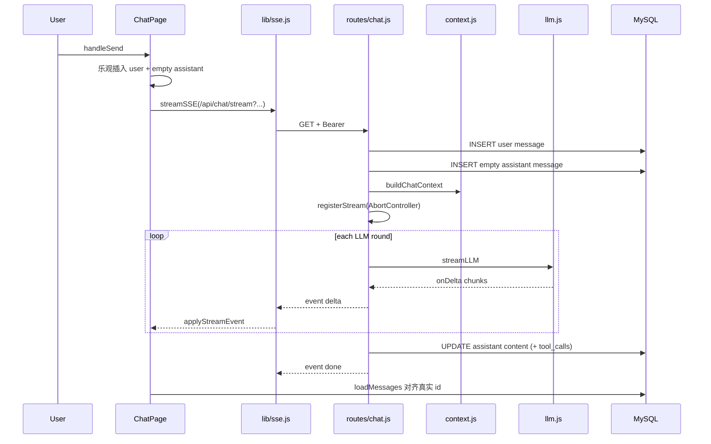

# 阶段 3：SSE 流式聊天全链路（核心）

## 目标

从点击发送到界面逐字更新、数据库落库、停止生成，能讲清整条链路（面试最高频）。

---

## 1. 为何不用 EventSource？

| | EventSource | 本项目 fetch 流 |
|--|-------------|-----------------|
| 自定义 Header | ❌ | ✅ `Authorization: Bearer` |
| 方法 | 仅 GET | GET |
| 解析 | 浏览器自动 | 手动按 `\n\n` 切事件 |

实现：`frontend/src/lib/sse.js` → `streamSSE({ url, token, onEvent, signal })`

### 解析流程（必背）

1. `fetch(url, { headers: { Authorization }, signal })`
2. `resp.body.getReader()` 循环读 chunk
3. `TextDecoder` 追加到 `buffer`
4. 以 `\n\n` 切分 SSE 事件块
5. 每块解析 `event:` 与 `data:` 行 → `JSON.parse` → `onEvent(event, data)`

### 前端事件处理 `applyStreamEvent`（`ChatPage.jsx`）

| event | 行为 |
|-------|------|
| `delta` | 追加最后一条 assistant 的 `content` |
| `tool_call` | 往 `toolCalls[]` push |
| `tool_result` | 按 `id` 合并 result/status |
| `error` | 覆盖 assistant 内容为错误文案 |
| `done` | 流正常结束（`streamSSE` 读完后由 `handleSend` 拉消息） |

---

## 2. 发送消息时序（端到端）



---

## 3. 后端 `routes/chat.js` 要点

### 3.1 入口校验

- `conversationId`、`content` 或 `attachmentIds` 必填
- `isStreaming(conversationId)` → **409** 防并发双流
- `SELECT ... WHERE user_id = ?` 校验归属

### 3.2 SSE 响应头

```js
res.set({
  'Content-Type': 'text/event-stream; charset=utf-8',
  'Cache-Control': 'no-cache, no-transform',
  Connection: 'keep-alive',
  'X-Accel-Buffering': 'no',
})
res.flushHeaders?.()
```

`send(event, data)` 格式：

```
event: delta
data: {"content":"你"}

```

**重要**：headers 已 flush 后，后续错误**不能**走全局 JSON 错误中间件，只能 `send('error', { message })`。

### 3.3 准备阶段（try 块 1）

1. `buildUserMessageWithAttachments` → INSERT user message
2. `linkFilesToMessage`（若有附件）
3. 首条消息时更新 `conversations.title`
4. INSERT **空** assistant message → 得到 `assistantMessageId`
5. `registerStream(conversationId, controller)`
6. `buildChatContext(...)` 组装发给 LLM 的 messages

### 3.4 生成阶段

**无 `LLM_API_KEY`**：mock 循环，每 20ms 发一个字符的 `delta`。

**有 Key**：`streamLLM` + 最多 `MAX_TOOL_ROUNDS = 5` 轮工具（阶段 4 详述）。

### 3.5 增量落库

```js
const scheduleSave = () => {
  clearTimeout(saveTimer)
  saveTimer = setTimeout(() => flushToDb(), 300)
}
```

每收到 delta 调度一次 debounce，**300ms** 后 `UPDATE messages SET content=?, tool_calls=?`。

### 3.6 取消与断开

| 机制 | 说明 |
|------|------|
| `streamManager.js` | `Map<conversationId, AbortController>` |
| `POST /chat/cancel` | `controller.abort()` |
| `req.on('close')` | 客户端断开 → `clientConnected = false`，停止 `send` |
| 前端 `handleStop` | cancel API + `streamRefs.abort()` |
| `AbortError` | 仍 `flushToDb()` 保留已生成部分 |

---

## 4. 上游 LLM `services/llm.js`

- POST `{LLM_BASE_URL}/chat/completions`，`stream: true`
- 解析 OpenAI 格式 SSE：`data: {...}`，`[DONE]` 结束
- 累积 `delta.content` → 回调 `onDelta`
- 累积 `delta.tool_calls` 分片（按 `index`）→ 返回 `{ text, toolCalls, finishReason }`
- `completeLLM`：非流式，供 **摘要** 使用（`context.js`）

---

## 5. 上下文 `services/context.js`

配置（`.env` 可选）：

| 变量 | 默认 | 含义 |
|------|------|------|
| `CONTEXT_RECENT_MESSAGES` | 20 | 保留最近完整消息条数 |
| `CONTEXT_COMPRESS_TOKEN_THRESHOLD` | 6000 | 超过则触发压缩 |
| `CONTEXT_MAX_TOKENS` | 8000 | 发给模型的上下文上限 |

流程摘要：

1. 读 `conversations.summary` / `summary_up_to_message_id`
2. 超出 `recentKeep` 的进 `oldBucket`
3. 若 `pendingOld` 有未摘要消息 → `summarizeBatch` → 写回 DB
4. 若仍超 `maxTokens` → 每次把 recent 最早 2 条移入摘要
5. 返回 `[{ role:'system', content: 系统提示+摘要 }, ...recentBucket]`

`estimateTokens`：`ceil(length/2)`，项目刻意不用 tiktoken 以降低依赖。

---

## 6. 动手实验

1. **抓包**：发「你好」，看 Response 是否 `text/event-stream`，是否有 `event: delta`。
2. **停止**：生成中点停止 → Network 里 `POST /api/chat/cancel`，流 abort。
3. **409**：同会话快速连发两条（第二条应失败或走 polling，见 `handleSend` catch 409）。
4. **断网**：飞行模式 → 应 toast 或 `event: error`。

---

## 7. 模拟面试五题（参考答案）

### Q1. SSE 与 WebSocket 区别？本项目为何选 SSE？

**答**：SSE 是单向服务器推送、基于 HTTP、自动重连语义简单；WebSocket 全双工，适合游戏、协作编辑。聊天场景主要是**服务端推 token 流**，客户端发消息用普通 HTTP GET/POST 即可，SSE 足够且与现有 Express 栈一致，无需维护 WS 连接状态机。

### Q2. 为何前端用 fetch 而不是 EventSource？

**答**：需要在请求头带 `Authorization: Bearer`。EventSource 不支持自定义头，只能把 token 放 URL（不安全）。fetch + ReadableStream 可手动解析 `text/event-stream`。

### Q3. 流式过程中如何持久化 assistant 消息？

**答**：进入流前先 `INSERT` 一条空 assistant 记录；每个 `delta` 通过 **300ms debounce** `UPDATE content`；结束时 `flushToDb` 并更新 `conversations.updated_at`。`tool_calls` 同字段 JSON 更新。

### Q4. 客户端断开连接后端如何处理？

**答**：`req.on('close')` 置 `clientConnected=false`，`send()` 不再写 socket；`AbortController` 可被取消；`finally` 里 `endStream` 清 Map。已生成内容在 abort 时仍会 `flushToDb`。

### Q5. 长对话如何控制 token？摘要存在哪？

**答**：`buildChatContext` 保留最近 N 条完整消息，更早的通过 `completeLLM` 增量摘要写入 **`conversations.summary`**，并用 `summary_up_to_message_id` 避免重复压缩。发给模型的是 system（含摘要）+ recent 消息。

---

## 8. 阶段验收

- [ ] 能白板画出 Client → chat.js → llm.js → DB
- [ ] 能解释 debounce 落库与 409 并发保护
- [ ] 独立完成第 7 节五题口述

下一阶段 → [04-tools-mcp.md](./04-tools-mcp.md)
