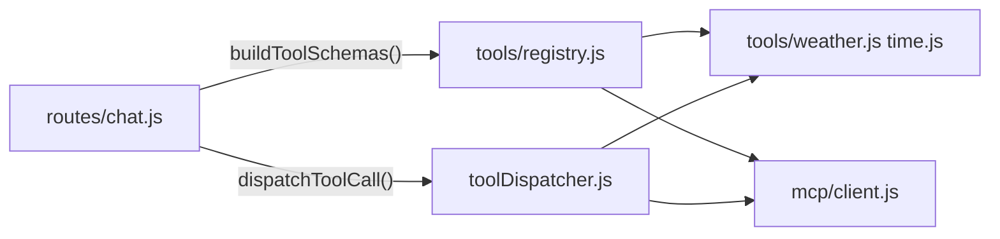

# 阶段 4：工具调用与 MCP

## 目标

说清 Function Calling 在本项目的分层、扩展方式，以及 LLM ↔ 工具 ↔ 再调 LLM 的闭环。

---

## 1. 架构分层



| 文件 | 职责 |
|------|------|
| `services/tools/<name>.js` | 本地工具：`async (args, { signal }) => result` |
| `services/tools/registry.js` | `LOCAL_SCHEMAS` + `localHandlers` + `buildToolSchemas()` |
| `services/toolDispatcher.js` | 按名路由本地/MCP，30s 超时，错误隔离 |
| `services/mcp/client.js` | 子进程 MCP：listTools、callTool |
| `backend/mcp.config.json` | MCP Server 配置（类 Claude Desktop） |

**禁止**：在 `chat.js` 直接 `import` 具体工具，只能 `buildToolSchemas` / `dispatchToolCall`。

---

## 2. 本地工具

### 注册（`registry.js`）

- `LOCAL_SCHEMAS`：OpenAI function JSON schema（发给 LLM）
- `localHandlers`：`{ get_weather: getWeather, get_current_time: getCurrentTime }`

### 示例能力

| 工具 | 文件 | 需要 Key |
|------|------|----------|
| `get_weather` | `weather.js` | ❌ Open-Meteo |
| `get_current_time` | `time.js` | ❌ |

### 设计原则（PROJECT_RULES 3.7）

- **一行能搞定**（当前时间）→ 本地，不要为小事起 MCP 子进程
- **外部 API / 社区生态** → MCP（Tavily、Memory）

---

## 3. MCP

### 配置 `backend/mcp.config.json`

- `enabled`：开关
- `command` / `args`：启动子进程（Windows 推荐 `node` + 本地路径，避免 npx `.cmd` 问题）
- `env`：`${TAVILY_API_KEY}` 等占位符从 `.env` 替换

启动日志示例：

```
[MCP] tavily ready, tools: [tavily_search, ...]
[MCP] memory ready, tools: [create_entities, ...]
```

### 工具名

MCP 工具常以 `serverName__toolName` 形式暴露（如 `tavily__tavily_search`），由 `isMcpTool(name)` 判断。

---

## 4. `chat.js` 工具循环

```js
for (let round = 0; round < MAX_TOOL_ROUNDS; round++) {
  const { text, toolCalls, finishReason } = await streamLLM({ tools: buildToolSchemas(), ... })

  if (finishReason !== 'tool_calls' || !toolCalls.length) break

  // SSE: tool_call → 并发 dispatchToolCall → tool_result
  // 把 assistant(tool_calls) + tool 结果消息追加到 currentMessages
}
```

要点：

1. 每轮 `streamLLM` 可能返回 `finishReason: 'tool_calls'`
2. 向前端 `send('tool_call')` / `send('tool_result')`
3. `toolCallTrace` 落库到 `messages.tool_calls`，刷新后可回显
4. `Promise.all` **并发**执行多个 tool call
5. 最多 **5 轮**，防止死循环

### `toolDispatcher.js`

```js
args = JSON.parse(argsJson)
isLocal ? localHandlers[name](args) : callMcpTool(name, args)
withTimeout(30_000)
// 返回 { result } 或 { error }，不抛到外层崩流
```

---

## 5. 前端展示

`components/chat/ToolCallCard.jsx`：在 `MessageBubble` 中展示 `toolCalls`（running/done/failed、参数、结果摘要）。

`applyStreamEvent` 在流式过程中实时更新卡片状态。

---

## 6. 动手实验

| 步骤 | 操作 | 预期 |
|------|------|------|
| 1 | 问「北京现在天气怎么样」 | `tool_call` get_weather → `tool_result` → 自然语言总结 |
| 2 | 问「今天几号星期几」 | `get_current_time` |
| 3 | 配置 `TAVILY_API_KEY`，问近期新闻 | tavily 系列工具（需 Key） |
| 4 | 问「我叫小明」再问「我叫什么」 | memory MCP（若 enabled） |

DevTools → stream 响应里过滤 `event: tool_call`。

---

## 7. 扩展指南

### 新增本地工具

1. 新建 `services/tools/exchange.js`
2. `registry.js`：`LOCAL_SCHEMAS` + `localHandlers` 各加一条
3. **无需**改 `chat.js` / `toolDispatcher.js`

### 新增 MCP

只改 `mcp.config.json` + `.env.example`，重启 backend。

---

## 8. 阶段验收

- [ ] 能画 LLM → tool_call → dispatcher → result → 再调 LLM 闭环
- [ ] 能说明本地 vs MCP 选型
- [ ] 能说出新增工具改哪些文件

---

## 9. 面试话术

1. **错误隔离**：工具失败返回 `{ error }` 写入 tool 消息，LLM 可据此改口，不拖垮 SSE。
2. **超时**：`AbortSignal` 链式传递，用户点停止会取消进行中的工具请求。
3. **可观测**：`tool_calls` JSON 存库，支持审计与 UI 回放。

下一阶段 → [05-files.md](./05-files.md)
