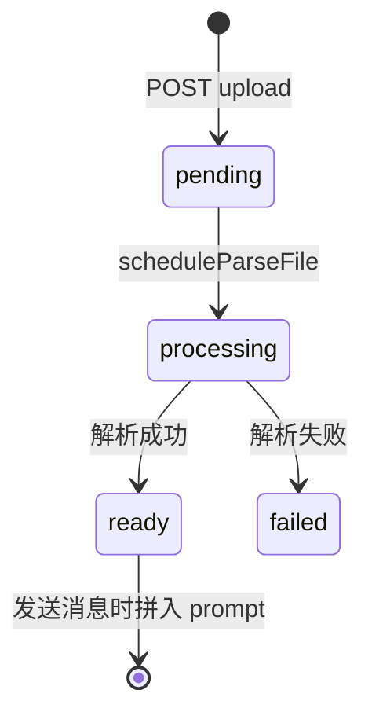

# 阶段 5：附件与分片上传

## 目标

理解文件从选择 → 上传 → 解析 → 进入 prompt → 发送的完整状态机。

---

## 1. 总览



| 阶段 | 位置 |
|------|------|
| 落盘 | `services/fileStorage.js` → `backend/uploads/` |
| 解析 | `services/fileParser.js`（txt/md/pdf/docx/代码等） |
| 入库 | `files.extracted_text`，`char_count`，`token_estimate` |
| 关联 | `message_files` 表 |

---

## 2. 后端 API（`routes/files.js`）

整模块 `authRequired`。

| 能力 | 路径 | 说明 |
|------|------|------|
| 整包上传 | `POST /upload` | multer，`UPLOAD_MAX_SIZE_MB`（默认 5MB） |
| 分片 init | `POST /upload/init` | 大文件，返回 `uploadId` |
| 分片 PUT | `PUT /upload/:uploadId/chunk/:index` | 二进制 body |
| 进度 | `GET /upload/:uploadId/status` | 断点续传 |
| 完成 | `POST /upload/:uploadId/complete` | 合并 → 走解析 |
| 元数据 | `GET /:id` | status、preview（最多 500 字） |
| 删除 | `DELETE /:id` | 未使用附件清理 |

`toFileDto`：**列表/详情默认不返回完整 `extracted_text`**，仅 `preview` 截断 500 字符（安全与体积）。

---

## 3. 发送时拼 prompt（`services/attachments.js`）

1. `parseAttachmentIds(req.query.attachmentIds)` — 逗号分隔 id
2. `loadReadyFilesForUser(ids, userId)` — 必须全部 `status='ready'` 且归属当前用户
3. `buildUserMessageWithAttachments(text, files)`：

```
【附件：文件名】
<extracted_text>

【用户问题】
<用户输入>
```

4. `INSERT` user message 后 `linkFilesToMessage(messageId, fileIds)`

聊天路由：`GET /api/chat/stream?conversationId=&content=&attachmentIds=1,2`

---

## 4. 前端流程

### `lib/files.js`

- `uploadFile`：小文件 POST `/files/upload`
- `pollFileUntilReady`：轮询 `GET /files/:id` 直到 `ready` 或 `failed`
- `deleteFile`：移除未发送附件

### `lib/chunkUpload.js`

大文件：init → 循环 PUT chunk → complete（见 `CHUNK_UPLOAD_MAX_SIZE_MB`）

### `ChatPage.jsx`

1. `handleSelectFile` → 本地 `attachments[]` 项（`localId`, `status: uploading`）
2. 文本类可先用 **Web Worker** `textFileParser.worker.js` 做客户端预览 `charCount`
3. `runFileUpload` → `uploadFile` → `parsing` → `pollFileUntilReady` → `ready`
4. `handleSend`：`attachmentIds` 拼进 stream URL，并清空当前会话 `attachments`

---

## 5. 限制（`config/upload.js` / env）

| 配置 | 典型值 | 含义 |
|------|--------|------|
| `UPLOAD_MAX_SIZE_MB` | 5 | 整包上限 |
| `UPLOAD_MAX_FILES_PER_MESSAGE` | 3 | 每条消息附件数 |
| `UPLOAD_MAX_TEXT_CHARS` | 80000 | 提取文本上限 |
| `CHUNK_SIZE_MB` | 2 | 分片大小 |
| `CHUNK_UPLOAD_MAX_SIZE_MB` | 50 | 分片总上限 |

---

## 6. 动手实验

1. 上传 `test.txt`，DevTools 轮询直到 `status: "ready"`。
2. 输入「总结附件」并发送，查看 stream URL 是否含 `attachmentIds=`。
3. 在 `messages` 表或刷新后 UI 看 user 消息是否带 `attachments` 元数据。
4. （可选）上传大于 5MB 文件，观察是否走 `chunkUpload.js`。

---

## 7. 阶段验收

- [ ] 能说明 `pending → processing → ready/failed`
- [ ] 能解释为何不返回完整 `extracted_text` 给列表 API
- [ ] 能复述 `attachmentIds` 到 prompt 的路径

---

## 8. 面试话术

1. **解析异步**：上传先返回 file id，后台 `scheduleParseFile`，前端轮询避免阻塞发送按钮（发送时校验 ready）。
2. **权限**：`loadReadyFilesForUser` 同时校验 id 列表与 `user_id`，防止猜 id 读他人文件。
3. **分片**：`upload_sessions` 记录 `received_chunks`，支持断点续传与过期清理（`index.js` 启动时 `cleanupExpiredUploadSessions`）。

下一阶段 → [06-ui-rules.md](./06-ui-rules.md)
