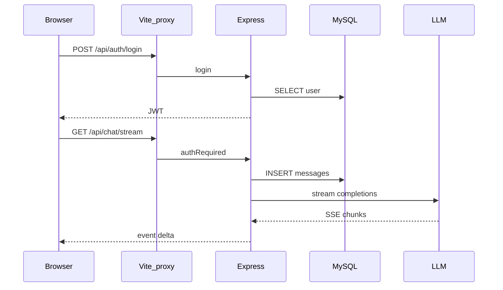

# 阶段 7：面试复盘手册

## 目标

整合全项目话术、默写练习与练手任务，达到「白板讲清主链路」。

---

## 1. 一分钟项目介绍（模板）

> react-ai 是我做的全栈 AI 聊天应用。前端 React 19 + Vite + Redux 管登录态，聊天状态在页面内按会话分片。后端 Express + MySQL，JWT 鉴权。核心是用 **SSE** 把 LLM 流式输出推到浏览器：因为 EventSource 不能带 Authorization，前端用 **fetch + ReadableStream** 解析事件。后端在 `chat` 路由里先落库 user/assistant 消息，再调 OpenAI 兼容接口，支持 **Function Calling**，本地工具与 **MCP** 统一走 dispatcher。长对话通过 **增量摘要** 写入 `conversations.summary` 控制 token。附件上传后异步解析文本，发送时拼进 prompt。

---

## 2. 架构速记

### 2.1 分层

```
routes（HTTP/SSE）→ services（业务/LLM/工具/文件）→ db/query
middleware：鉴权、上传
```

**何时下沉 services**：多表、多步、需复用（见 PROJECT_RULES 3.2 决策树）。

### 2.2 无状态 JWT

| 优点 | 缺点 |
|------|------|
| 扩展简单，无 session 存储 | 难主动吊销单 token |
| 适合前后端分离 | payload 不宜过大 |

**扩展**：refresh token、redis 黑名单、短期 access + 长期 refresh。

### 2.3 错误处理

- REST：`HttpError`（`expose: true` 返回业务 message）+ 全局 middleware
- SSE：headers 已 flush → 仅 `event: error`；500 细节打日志不返回堆栈

---

## 3. 默写练习：从登录到首条流式回复

关闭 IDE，在纸上画：



检查点：代理、JWT、INSERT 两条消息、`buildChatContext`、debounce UPDATE。

---

## 4. 深挖题参考答案

### Mock 模式

- **无 `LLM_API_KEY`**：`chat.js` 本地 for 循环 mock 字符；`context.js` 的 `summarizeBatch` 用 `buildMockSummary`
- **有 Key**：走真实 `streamLLM` / `completeLLM`

### `streamManager` vs DB 行锁

| 方案 | 作用 |
|------|------|
| 内存 Map + AbortController | 单进程内取消与 `isStreaming` 查询，轻量 |
| DB `FOR UPDATE` | 多实例部署时防双流，更重 |

本项目偏骨架/单实例，用内存即可；面试可提水平扩展要 Redis 锁或 DB 锁。

### 增量摘要 vs 每轮全量压缩

| 增量（本项目） | 全量 |
|----------------|------|
| 只摘要 `id > summary_up_to_message_id` 的消息 | 每轮重算全部历史 |
| 省 LLM 调用与延迟 | 实现简单但贵 |

---

## 5. 扩展题思路

| 需求 | 改动点 |
|------|--------|
| 多模型切换 | `services/llm.js` 读 model 参数；前端下拉；`conversations` 可加 `model` 列 |
| WebSocket 替代 SSE | 评估收益；需双向时常用 WS；纯推流 SSE 更简单 |
| RAG | 新 `services/retrieval.js`；`buildChatContext` 注入检索片段；向量库独立 |

---

## 6. 按文件 3 句话（口述素材）

| 文件 | 职责 |
|------|------|
| `index.js` | Express 装配、MCP 生命周期、全局错误 |
| `auth.js` | 注册登录、bcrypt、JWT |
| `conversations.js` | 会话 CRUD、消息列表含附件与 toolCalls |
| `chat.js` | SSE 主流式、工具循环、落库 |
| `llm.js` | 上游 SSE 解析、tool_calls 累积 |
| `context.js` | 摘要 + recent 消息组装 |
| `streamManager.js` | 会话级 AbortController |
| `registry.js` / `toolDispatcher.js` | 工具注册与分发 |
| `api.js` | axios + 401 跳转 |
| `sse.js` | fetch 解析 SSE |
| `ChatPage.jsx` | 会话状态、发送、流式 UI 更新 |

---

## 7. 练手任务（选 1～2 个）

完成其一即可勾选 [CHECKLIST.md](./CHECKLIST.md) 阶段 7。

### A. 会话列表「最后一条消息预览」（推荐）

- 后端：`GET /conversations` 子查询最后一条 `messages.content` 前 50 字
- 前端：`Sidebar` 展示副标题

### B. 本地工具 `get_exchange_rate`

- 新建 `services/tools/exchange.js`（可 mock 汇率）
- 改 `registry.js` 两处注册
- 用对话触发 function call

### C. 调整上下文保留条数

- 修改 `.env` 的 `CONTEXT_RECENT_MESSAGES`
- 用超长对话观察摘要是否写入 `conversations.summary`

---

## 8. 模拟面试（自问自答 10 题）

1. 前后端如何协作鉴权？
2. 为什么 SSE 用 GET？发送 body 不行吗？（本项目 GET query 带 content；可讨论 POST+SSE 替代）
3. 如何保证用户 A 看不到用户 B 的会话？
4. 流式中断后数据一致性？
5. tool_call 失败怎么办？
6. 附件太大怎么办？（分片 + 字符上限截断）
7. MCP 进程挂了对聊天有何影响？（单工具 error，其他照常）
8. 为何把聊天状态放在 ChatPage 而非 Redux？
9. Vite 生产环境 API 怎么部署？（同域反代或 `VITE_API_BASE`）
10. 若 QPS 升高，瓶颈可能在哪？（LLM 上游、MySQL 写 messages、MCP 子进程）

---

## 9. 学习完成标志

- [ ] 能在 5 分钟内白板讲主链路
- [ ] 阶段 3 五题 + 本节 10 题能流畅回答
- [ ] 至少完成一节「练手任务」
- [ ] 笔记中有 3 条以上自己的「面试话术」（非照抄文档）

---

返回目录 → [README.md](./README.md)
